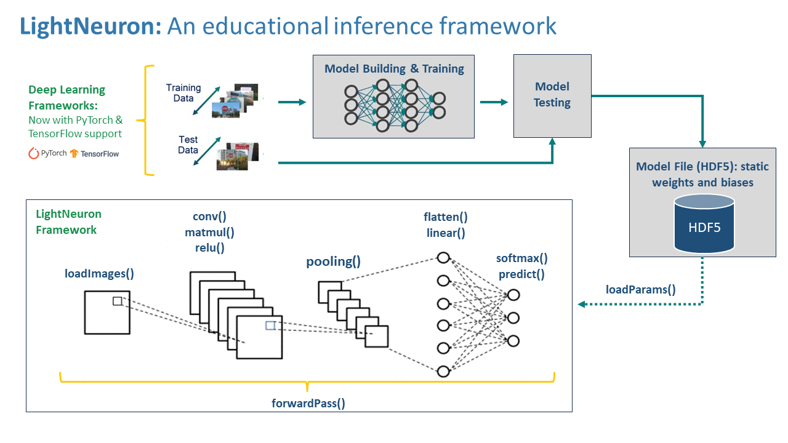
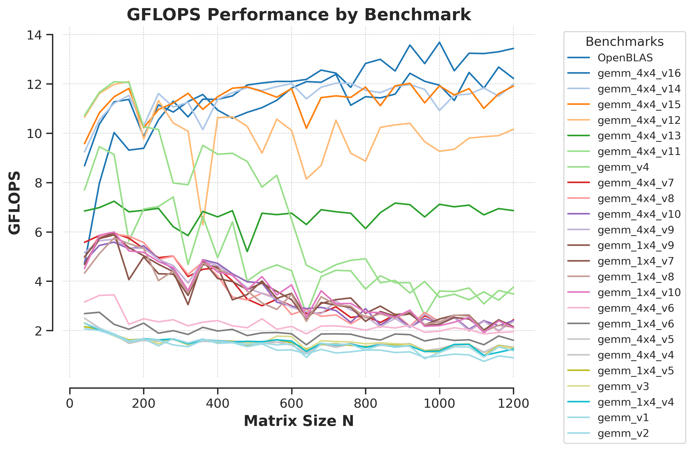

# LightNeuron 


LightNeuron is a lightweight neural network library, written in C and optimized for x86-64 systems. It's designed to be a learning tool for understanding the inner workings of neural networks, as well as a practical guide for learning profiling and improving key computations such as General Matrix Multiply (GEMM).

## Inference Framework



### Prerequisites

To ensure your system's compatibility and performance optimization, it's crucial to verify and install the `perf` tool, aligning with your kernel version. Use the following commands:

```bash
sudo apt-get install linux-tools-$(uname -r) linux-cloud-tools-$(uname -r)
```
Adjusting `perf_event_paranoid` and disabling `nmi_watchdog`. This setting manages the access of non-privileged users to CPU performance events. Modify it by adding or altering this line in `/etc/sysctl.conf`:

```bash
kernel.perf_event_paranoid = -1
kernel.nmi_watchdog = 0
```

To activate these changes, execute:

```bash
sudo sysctl -p
```

### Usage Guide for Inference Framework

1. **Cloning the Repository**: Initiate by cloning this repository.
2. **Acquiring MNIST Dataset**: Use the following command:
   ```bash
   python get_data.py
   ```
3. **Compiling and Running Labs**: Execute the lab files for each session:
   ```bash
   make lab && ./lab
   ```

### Profiling Guide for GEMM in Inference Framework

To profile the performance of General Matrix Multiply (GEMM) operations with a focus on specific targets and cache levels, you can use a makefile command with a specified target and cache level argument. The command format is as follows:

```bash
make perf TARGET=[your-target] CACHE_LEVEL=[your-cache-level] USE_PMU=1
```

Here's how you might use the command:

- `TARGET` should be replaced with the specific GEMM implementation you wish to test (for example, `matmul_naive`).
- `CACHE_LEVEL` should be set to the cache level you're interested in analyzing (such as `L1`, `L2`, or `L3`).

For instance, if you want to profile a naive matrix multiplication implementation focusing on the L1 cache, the command would look like this:

```bash
make perf TARGET=matmul_naive CACHE_LEVEL=L1 USE_PMU=1
```

In this command, `USE_PMU=1` likely activates the Performance Monitoring Unit (PMU), which is a set of special-purpose registers for monitoring hardware-level events related to performance. 

Remember to replace `[your-target]` and `[your-cache-level]` with the appropriate values for your profiling requirements.

## GEMM Performance Comparison



